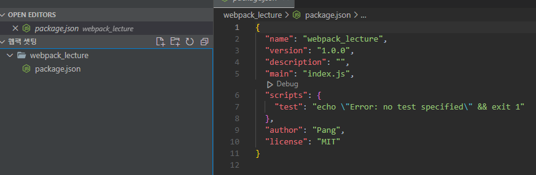

# create-react-app 쓰지 않고 직접 웹팩 설정하기

> react, react-dom 설치
>
> typescript 설치
>
> eslint 설치
>
> prettier 설치
>
> 웹팩 및 babel 설치

## 1. package.json 생성

```
npm init
```



커맨드 창에서 `npm init` 을 하면 기본 `package.json`이 생성된다.

## 2. 리액트 설치

```
npm i react react-dom
```

리액트와 리액트 돔 설치 다른 설정 필요 없음

## 3. 타입스크립트 설치

```
npm i typescript
npm i @types/react @types/react-dom
```

기본 타입스크립트와 리액트용 타입스크립트 설치 다른 설정 필요 없음

## 4. eslint, prettier 설치

VSCode 플러그인으로 ESLint와 Prettier를 설치해야한다.

기본적인 세팅은 플러그인 설치 후 되어있지만 팀원과의 공통 세팅을 위해 파일로 설정을 만든다.

```
npm i -D eslint
npm i -D prettier eslint-plugin-prettier eslint-config-prettier
```

프로젝트 가장 상단에(package.json 위치와 똑같이)

`.eslintrc`

```
{
  "extends": ["plugin:prettier/recommended"]
}
```

`.prettierrc`

```
{
  "printWidth": 120,
  "tabWidth": 2,
  "singleQuote": true,
  "tranilingComma": "all",
  "semi": true
}
```

## 5. webpack 설치

webpack은 실제 운영에서 필요없기 때문에 개발에서만 쓰일용으로 설치

```
npm i -D webpack webpack-cli

npm i -D webpack @babel/core babel-loader @babel/preset-env @babel/preset-react

npm i -D @types/webpack @types/node @babel/preset-typescript

npm i style-loader css-loader
```

style-loader와 css-loader는 webpack에서 import하는 css를 변환해주는 용도로 따로 config 설정 해주어야함.

## 6. typescript

## Webpack

```
import path from 'path';
import ReactRefreshWebpackPlugin from '@pmmmwh/react-refresh-webpack-plugin';
import webpack, { Configuration as WebpackConfiguration } from 'webpack';
import { Configuration as WebpackDevServerConfiguration } from 'webpack-dev-server';
import { BundleAnalyzerPlugin } from 'webpack-bundle-analyzer';

interface Configuration extends WebpackConfiguration {
  devServer?: WebpackDevServerConfiguration;
}

import ForkTsCheckerWebpackPlugin from 'fork-ts-checker-webpack-plugin';

const isDevelopment = process.env.NODE_ENV !== 'production';

const config: webpack.Configuration = {
  name: 'sleact',
  mode: isDevelopment ? 'development' : 'production',
  devtool: !isDevelopment ? 'hidden-source-map' : 'eval',
  resolve: {
    extensions: ['.js', '.jsx', '.ts', '.tsx', '.json'],
    alias: {
      '@hooks': path.resolve(__dirname, 'hooks'),
      '@components': path.resolve(__dirname, 'components'),
      '@layouts': path.resolve(__dirname, 'layouts'),
      '@pages': path.resolve(__dirname, 'pages'),
      '@utils': path.resolve(__dirname, 'utils'),
      '@typings': path.resolve(__dirname, 'typings'),
    },
  },
  entry: {
    app: './client',
  },
  module: {
    rules: [
      {
        test: /\.tsx?$/,
        loader: 'babel-loader',
        options: {
          presets: [
            [
              '@babel/preset-env',
              {
                targets: { browsers: ['last 2 chorme versions', 'IE 10'] },
                debug: isDevelopment,
              },
            ],
            '@babel/preset-react',
            '@babel/preset-typescript',
          ],
        },
        exclude: path.join(__dirname, 'node_modules'),
      },
      {
        test: /\.css?$/,
        use: ['style-loader', 'css-loader'],
      },
    ],
  },
  plugins: [
    new ForkTsCheckerWebpackPlugin({
      async: false,
      // eslint: {
      //   files: "./src/**/*",
      // },
    }),
    new webpack.EnvironmentPlugin({ NODE_ENV: isDevelopment ? 'development' : 'production' }),
  ],
  output: {
    path: path.join(__dirname, 'dist'),
    filename: '[name].js',
    publicPath: '/dist/',
  },
  devServer: {
    historyApiFallback: true, // react router
    port: 3090,
    devMiddleware: { publicPath: '/dist/' },
    static: { directory: path.resolve(__dirname) },
    proxy: {
      '/api/': {
        target: 'http://localhost:3095',
        changeOrigin: true,
      },
    },
  },
};

if (isDevelopment && config.plugins) {
  config.plugins.push(new webpack.HotModuleReplacementPlugin());
  config.plugins.push(new ReactRefreshWebpackPlugin());
  config.plugins.push(new BundleAnalyzerPlugin({ analyzerMode: 'server', openAnalyzer: true }));
}
if (!isDevelopment && config.plugins) {
  config.plugins.push(new webpack.LoaderOptionsPlugin({ minimize: true }));
  config.plugins.push(new BundleAnalyzerPlugin({ analyzerMode: 'static' }));
}

export default config;


```
