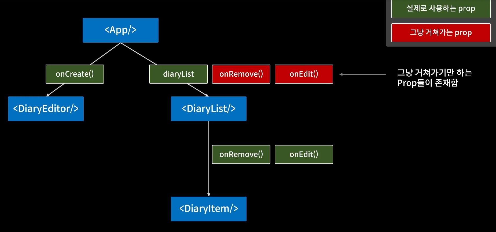

# 리액트

## 복잡한 상태 관리 로직 분리하기 useReduce


useReduce는 상태 관리가 매우 복잡할 때 사용한다.

```javascript
const reducer = (state, action) => {
  switch (action.type) {
    case 1:
      return state + 1;
    case 10:
      return state + 10;
  }
};

const Counter = () => {
  const [count, dispatch] = useReducer(reducer, 1);

  return (
    <div>
      {count}
      <button onClick={() => dispatch({ type: 1 })}>+1</button>
      <button onClick={() => dispatch({ type: 10 })}>+10</button>
    </div>
  );
};
```

이벤트가 일어나면 `dispatch`로 `action` 객체를 넣어주고(상태 변화) `reducer`는 최신 상태인 `state`와 `action`객체를 받아 상태 변화를 일으킨다.

## 컴포넌트 트리에 전역 데이터 공급 Context

트리 구조가 깊어지는 경우 가장 하부에 있는 컴포넌트에서 `state`를 수정하는 경우 부모 컴포넌트까지 올라와서 메서드를 구현하고 자식 컴포넌트까지 메서드를 넣어주어야 했다.

단방향 데이터 이동을 하는 리액트 구조상 어쩔 수 없이 행해진 일이다.



> `<App />` ==모든 데이터, 필요한 메서드, 객체==> 자식 컴포넌트들
>
> 변경=>
>
> `<App />` ==모든 데이터==> `<Provider />` ==필요한 메서드, 객체==> 자식 컴포넌트들

`Provider`가 모든 걸 관리해서 데이터를 공급해주는 모습을 `Context`라고 부른다.


```javascript
//넣어주는 곳
export const MyDataContext = React.createContext(defaultValue);
export const MyDispatchContext = React.createContext();

const reducer = (state, action) => {
  switch(action.type) {
    case "CREATE": {
      return [...state, action.data]
    }
    case "UPDADTE": {
      return state.map((it) => it.id !== action.id ? {...it, content: action.content } : it);
    }
    case "DELETE": {
      return state.filter((it) => it.id !== action.id);
    }
    default: return state;
  }
}

const App = () => {


  const [data, dispatch] = useReducer(reducer, []);

  const memoizedDispatches = useMemo(() => {
    return {onCreate, onUpdate, onRemove};
  }, []);

  return (
    <MyDataContext.Provider value={ 전역으로 전달하고자 하는 값 }>
      <MyDispatchContext.Provider value={ memoizedDispatches }>
      { Context안에 위치할 자식 컴포넌트들 }
      </MyDispatchContext.Provider>
    </MyDataContext.Provider>
  );
}


//받는 곳
const Component = () => {
  const { data } = useContext(MyDataContext);
  const { onCreate, onUpdate } = useContext(MyDispatchContext);
}
```

단순 객체의 경우 `Context`를 만들어 value에 넣어서 사용하면 된다. 그러나 메서드들의 경우 원치않는 리렌더링이 일어날 수 있다. 그래서 `useMemo`를 이용해서 `Dispatch` 변수를 만들고, 그걸 `Provider`의 `value`에 넣어서 사용한다.
